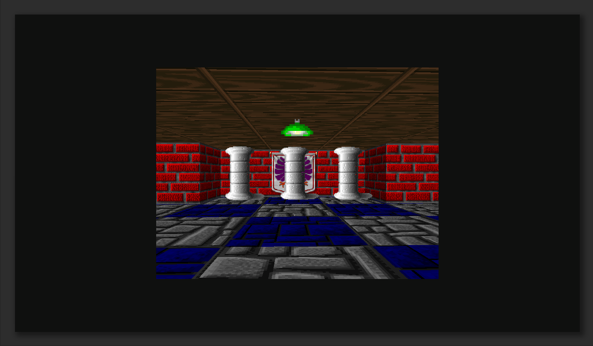

# caster

A SDL2 Raycasting in Go following [lodev raycasting](https://lodev.org/cgtutor/raycasting.html)

The six code sections correspond to four articles:
‌
1. Raycasting: Untextured and Textured Walls‌ (Parts 1-3)
2. Raycasting II: Floor and Ceiling‌ (Part 4)
3. Raycasting III: Sprites‌ (Part 5)
4. Raycasting IV: Directional Sprites, Doors, Secrets, Fog, Enemies, and More‌ (Part 6)

Part 6 is derived from [raycaster_pitch.cpp](https://lodev.org/cgtutor/files/raycaster_pitch.cpp) with corresponding adjustments.

